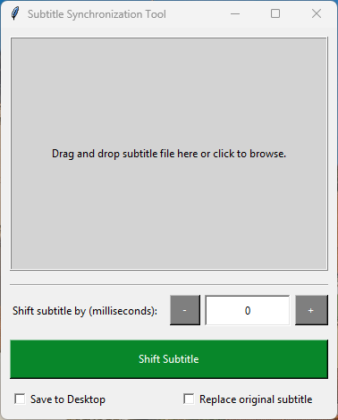
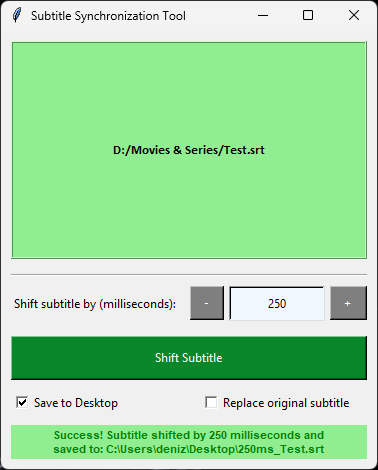

# SubtitleSync: Subtitle Shift / Subtitle Synchronization Tool
Subtitle Synchronization Tool is a Python application designed to effortlessly synchronize subtitle files by shifting them by a specified number of milliseconds. Whether you need to adjust subtitles for a movie or a video, this tool offers a simple and intuitive interface to perform the task efficiently.

> # [Download the Latest Executable (.exe) Release](https://github.com/denizsafak/SubtitleSync/releases/latest)
> You can download the executable (.exe) version of the same script, making it easy to use without the need to install Python or other libraries.

## `How to Run?`

### Option 1: Executable Script
- If you prefer not to install Python, download the precompiled executable version from the Releases section.
[Download the Latest Executable (.exe) Release](https://github.com/denizsafak/SubtitleSync/releases/latest)
- Double-click on the executable file to launch the application.

### Option 2: Run with Python
- Clone or download the repository to your local machine.
- Install Python to your computer.
- Run "run.bat" file.
- The Subtitle Synchronization Tool interface will appear on your screen.

## `Useage`
1) Drag and Drop: Drag and drop a subtitle file onto the interface.
2) Browse: Alternatively, click on the interface to browse your system and select a subtitle file.
3) Set Milliseconds: Enter the number of milliseconds by which you want to shift the subtitles.
4) Choose Options: Select whether you want to save the shifted subtitle to the desktop or replace the original file.
4) Click Sync: Click on the "Shift Subtitle" button to synchronize the subtitle file.

## `Features`
- Subtitle Shifting: Easily adjust subtitle timing by specifying the number of milliseconds to shift.
- Drag and Drop: Simply drag and drop subtitle files onto the interface to begin the synchronization process.
- File Browser: Alternatively, you can browse your system to select the subtitle file you want to synchronize.
- Customization Options: Choose whether to save the shifted subtitle file to the desktop or replace the original file.
- Informative Messages: Receive clear feedback messages indicating the success or failure of the synchronization process.

> [!NOTE]
> - This script is primarily intended for Windows. Adaptations might be needed for other operating systems.

> Tags: subtitle synchronization, subtitle shifter, subtitle adjuster, subtitle tools, subtitle utilities, synchronize subtitles, adjust subtitle timing, subtitle management, Python subtitle tool, subtitle manipulation, subtitle synchronization script.
