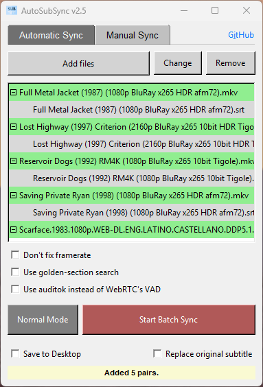

# AutoSubSync: Automatic / Manual Subtitle Synchronization Tool
AutoSubSync is a Python-based application designed to effortlessly synchronize subtitle files by shifting them by a specified number of milliseconds or automatically syncing them. Whether you need to adjust subtitles for a movie or a video, this subtitle sync fixing tool offers a simple and intuitive interface to perform the task efficiently.

> # [Download the Latest Release](https://github.com/denizsafak/AutoSubSync/releases/latest)
> You can download the latest version of the same script from this link.

## `How to Run?`
- Extract the zip.
- Run "run.bat" file.
- After installing the requirements, AutoSubSync will start automatically.

## `Useage`
### Automatic Synchronization
- **Select Video/Reference subtitle and Subtitle Files:**
   - Drag and drop the video and subtitle files into the respective input boxes.
   - Alternatively, click on the input boxes to browse and select the files.
- **Choose Synchronization Tool:**
   - Select the synchronization tool (`ffsubsync` or `alass`) from the dropdown menu.-
- **Set Options:**
   - Configure additional options such as `Don't fix framerate`, `Use golden-section search`, and `Use auditok instead of WebRTC's VAD` for `ffsubsync`.
   - For `alass`, configure options like `Disable FPS guessing`, `Disable speed optimization`, and set the `Split Penalty`.
- **Select Output Location:**
   - Choose where to save the synchronized subtitle file using the dropdown menu.
- **Start Synchronization:**
   - Click the `Start Automatic Sync` button to begin the synchronization process.
- **Batch Mode:**
   - Enable batch mode to process multiple files at once. Drag and drop multiple files or folders into the batch input area.
   - You can also add `reference subtitle - subtitle` pairs in batch mode. Just try to add subtitles and it will ask you how you want to add them. You can add them as subtitles with [no video] or reference subtitles with [no subtitle] input.
   - Also, use `Reference subtitle/subtitle parir` to automaticallty pair multiple subtitles with similar names. For example “S01E01 pairs with 01x01.
   - `Double click` any item to change them.
   - Use `del` key to delete any item.
     
### Manual Synchronization
- **Select Subtitle File:**
   - Drag and drop the subtitle file into the input box.
   - Alternatively, click on the input box to browse and select the file.
- **Set Time Shift:**
   - Enter the number of milliseconds to shift the subtitle. Use the `+` and `-` buttons to adjust the value.
- **Choose Output Option:**
   - Select whether to save the shifted subtitle to the desktop or replace the original subtitle file.
- **Start Shifting:**
   - Click the `Shift Subtitle` button to apply the time shift.
 
### Settings (Top Right Corner)
- Additional arguments for ffsubsync: Configure additional arguments for ffsubsync.
- Additional arguments for alass: Configure additional arguments for alass.
- Check video for subtitle stream in alass: Toggle for checking the subtitle streams in video for alass.
- Backup subtitles before overwriting: Toggle for creating a backup of subtitles before overwriting them.
- Keep converted subtitles: Toggle for keeping the converted subtitles after synchronization.
- Keep Extracted Subtitles: Toggle to keeping the extracted subtitles after synchronization.
- Remember the Changes: Toggle for remembering changes made.
- Reset to Default Settings: Restore settings to default values.

## `Features`
- “Reference Subtitle/Subtitle Pairing”, so you can automaticallty pair multiple subtitles with similar names. For example “S01E01 pairs with 01x01”
- Choose between alass and ffsubsync for automatic subtitle syncing.
- Batch processing for multiple video/reference subtitle and subtitle pairs.
- Support for different subtitle types: .srt, .vtt, .sbv, .sub, .ass, .ssa, .dfxp, .ttml, .itt, .stl.
- Automatic Subtitle Synchronization: Automatically sync the subtitles with the video/reference subtitle, using [ffsubsync](https://github.com/smacke/ffsubsync) or [alass](https://github.com/kaegi/alass).
- Subtitle Shifting: Easily adjust subtitle timing by specifying the number of milliseconds to shift.
- Drag and Drop: Simply drag and drop subtitle and video files onto the interface to begin the synchronization process.
- Customization Options: Choose whether to save the shifted subtitle file to the desktop or replace the original file.
- Informative Messages: Receive clear feedback messages indicating the success or failure of the synchronization process.

## `Credits`
- Thanks to creators of [ffsubsync](https://github.com/smacke/ffsubsync), [alass](https://github.com/kaegi/alass), [ffmpeg](https://www.ffmpeg.org/) and others. The automatic subtitle syncing feature is possible because of ffsubsync and alass. This is just a GUI application for Windows that makes the process a bit easier. At the beginning, it was just a manual subtitle syncing program. Now it can do both manual and automatic subtitle sync.
- Icon: [Subtitles icons created by Freepik - Flaticon](https://www.flaticon.com/free-icons/subtitles)

> [!IMPORTANT]
> - The automatic sync feature is not perfect. I recommend you to check the subtitle after syncing.

> [!NOTE]
> - This script is primarily intended for Windows. Adaptations might be needed for other operating systems.

> Tags: automatic subtitle synchronization, autosubsync, automatic sub sync, subtitle synchronization, subtitle shifter, subtitle adjuster, subtitle tools, subtitle utilities, synchronize subtitles, adjust subtitle timing, subtitle management, Python subtitle tool, subtitle manipulation, subtitle synchronization script, subtitle sync fixing, subtitle sync fix, fix subtitle sync.
