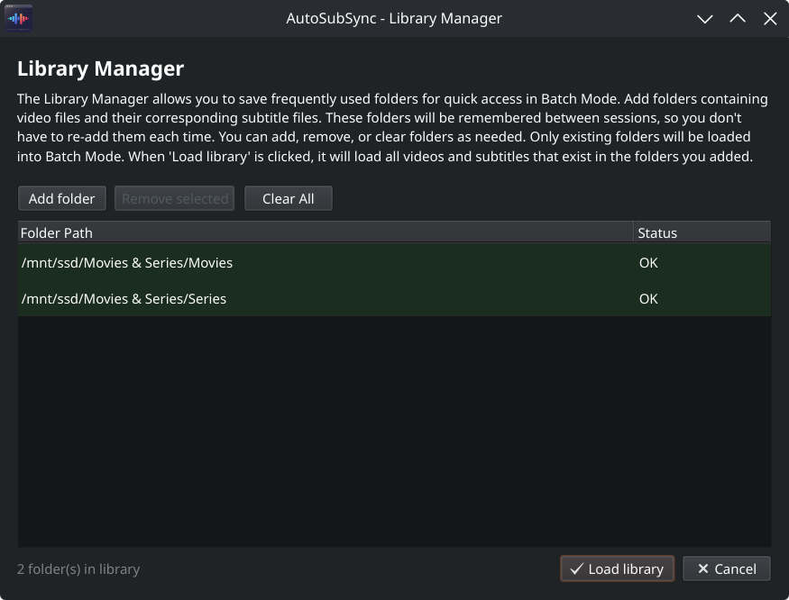
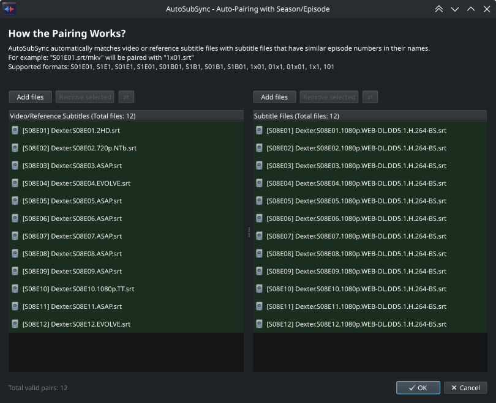
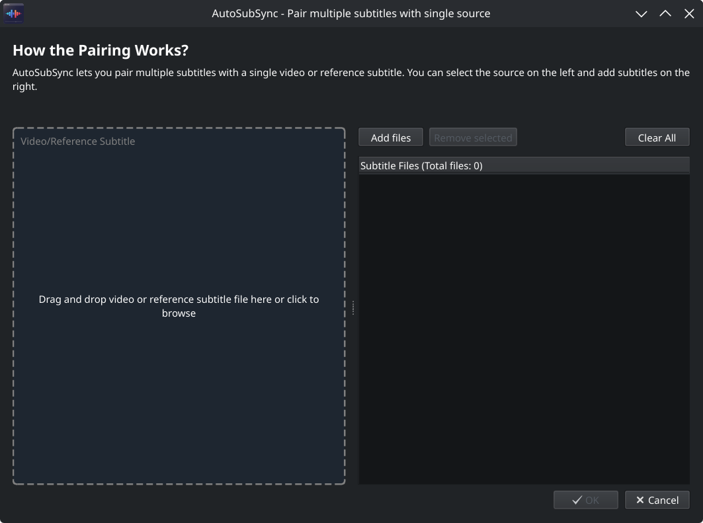

# AutoSubSync: Automatic / Manual Subtitle Synchronization Tool 

[](https://github.com/denizsafak/AutoSubSync/actions)
<a href="https://github.com/psf/black"></a>
[](https://github.com/denizsafak/AutoSubSync/releases/latest)
[](https://github.com/denizsafak/AutoSubSync/releases/latest)
[](https://github.com/denizsafak/AutoSubSync/releases/latest)

AutoSubSync is a user-friendly tool that automatically synchronizes your subtitles with your videos using powerful tools such as [ffsubsync](https://github.com/smacke/ffsubsync), [autosubsync](https://github.com/oseiskar/autosubsync) and [alass](https://github.com/kaegi/alass). It also lets you manually adjust the subtitle timings. Just drag and drop your files, and let AutoSubSync do the rest, making subtitle alignment both simple and efficient.

   

> # [Download the Latest Release](https://github.com/denizsafak/AutoSubSync/releases/latest)
> You can download the latest executable version of AutoSubSync for `Windows`, `Linux`, and `MacOS` from this link, or you can also download AutoSubSync from AUR in Arch Linux using the following command:
> ``` 
>yay -S autosubsync-bin 
>```
> Thanks to [@Rainoutt](https://github.com/Rainoutt) for the [AUR](https://aur.archlinux.org/packages/autosubsync-bin) package.

## `How to Run?`
- Extract the zip.
- Double click "AutoSubSync".

> MacOS users please read [this](#for-macososx-users).

## `Features`

### Automatic Synchronization

Synchronize subtitles with video files using one of three available synchronization tools. Each tool uses a different approach, so if one doesn't produce satisfactory results, you can try another.

- **[ffsubsync](https://github.com/smacke/ffsubsync)** – Analyzes the audio track of the video and aligns subtitles to match the speech. Works well for most content.
- **[autosubsync](https://github.com/oseiskar/autosubsync)** – Uses machine learning to detect speech patterns and synchronize subtitles accordingly.
- **[alass](https://github.com/kaegi/alass)** – Can align subtitles using either audio analysis or a reference subtitle file. Generally faster than other tools, and most of the time produces accurate results.

Instead of using a video file as the source, you can also use a correctly-timed reference subtitle file. This is useful when you have subtitles in one language that are already synchronized and want to sync subtitles in another language to match.

---

### Manual Synchronization

Shift all subtitle timings by a specified number of milliseconds. Use positive values to delay subtitles (make them appear later) or negative values to advance them (make them appear earlier).

This is useful for fine-tuning results after automatic synchronization, or when you know the exact offset needed. The interface provides increment and decrement buttons for small adjustments, or you can enter a specific value directly.

You can choose to save the adjusted subtitle to your desktop as a new file, or replace the original subtitle file.

---

### Batch Processing

Process multiple video-subtitle pairs in a single operation. Enable batch mode to access the batch list and additional file management options.

**Adding files to the batch list:**

| Option | Description |
|--------|-------------|
| `Add pair` | Manually select a video file and a subtitle file to add as a pair. |
| `Add pair (continuously)` | Keep adding video-subtitle pairs until you cancel. |
| `Add folder` | Select a folder to scan for video and subtitle files, including all subfolders. (Videos and subtitles with matching filenames will be paired automatically.) |
| `Add multiple files` | Select multiple files at once to add to the list. (Videos and subtitles with matching filenames will be paired automatically.) |
| `Auto-Pairing with Season/Episode` | Automatically match videos with subtitles based on episode patterns (see [Auto-Pairing with Season/Episode](#auto-pairing-with-seasonepisode)). |
| `Pair multiple subtitles with single source` | Pair multiple subtitle files with one video (see [Pair multiple subtitles with single source](#pair-multiple-subtitles-with-single-source)). |

> You can also drag and drop files or folders directly onto the batch list.

---

### Sync Tracking

AutoSubSync maintains a database of videos that have been synchronized previously. When you add videos to the batch list, any videos that have been previously processed are automatically identified and marked to be skipped. This feature is designed for **video files only**; reference or output subtitle files are not tracked.

Videos are identified by their content using a hash, not by their filename or location. This means **you can rename, move, or reorganize your videos** and AutoSubSync will still recognize them as already processed.

In the batch list, previously processed videos appear greyed out with a `Status: Skipped` tooltip.

**Right-click on items in the batch list to access the following options:**

| Option | Description |
|--------|-------------|
| `Force process selected video(s)` | Force-process the selected videos again even though they were previously processed. |
| `Skip processing selected video(s)` | Mark the selected videos to be skipped **without** adding them to the database. |
| `Add selected video(s) to processed items database` | Mark the selected videos as **processed** without actually syncing them. |
| `Remove selected video(s) from processed items database` | **Remove** selected videos from the processed items database so they can be processed again without forcing. |

**Sync tracking menu options:**

| Option | Description |
|--------|-------------|
| `Enable/Disable sync tracking` | Toggle the sync tracking system on or off. When disabled, **no videos will be automatically skipped**, **newly synced videos will not be added to the database**, and **sync-related options will not appear in Batch Mode**. |
| `Clear processed items database` | Remove all entries from the database. All videos will be treated as unprocessed. **Please be careful with this action, as it cannot be undone, if you have not backed up your database.** |
| `Backup processed items database` | Export your database to a file for safekeeping or transfer to another computer. |
| `Import processed items database` | Import entries from a backup file. Duplicate entries are automatically ignored. |
| `Manage library folders` | Open the Library Manager to add or remove saved folders. |
| `Load library` | Load all videos and subtitles from your saved library folders into the batch list. |

**Location:** `Settings` → `Sync tracking`, or the `Sync tracking` button in Batch Mode

> You can locate your processed items database file `(processed_items.db)` using `Open config file directory` in the `Settings` menu.

---

### Library Manager

Save folders containing your media files for quick access. The Library Manager stores your folder list in a database that persists between sessions.

Add folders that contain video files and their corresponding subtitle files. When you click `Load library`, all video and subtitle files from your saved folders are loaded into the batch list. This is useful if you regularly work with the same media collection and want to quickly check for new content to process.

You can add new folders, remove individual folders, or clear the entire list.

**Location:** `Settings` → `Sync tracking` → `Manage library folders`, or `Batch Mode` → `Sync tracking` → `Manage library folders`

> You can locate your library database file `(library_folders.db)` from `Open config file directory` in the `Settings` menu.



---

### Auto-Pairing with Season/Episode

When working with TV series or other episodic content, AutoSubSync can automatically match video files with their corresponding subtitle files based on season and episode information in the filenames.

Supported naming patterns include:
- `S01E01`, `s01e01` – Standard season/episode format
- `1x01`, `01x01` – Alternative format with 'x' separator
- Various other common episode numbering schemes

This feature is particularly useful when you have a folder of video files and a separate folder of subtitle files that need to be paired up.

Location: Enable **Batch Mode**, then click input box to open the batch add menu, and select `Auto-Pairing with Season/Episode`.



---

### Pair Multiple Subtitles with Single Source

In Batch Mode, you can pair multiple subtitle files with a single video or reference subtitle. This allows you to synchronize subtitles in several languages against the same source in one batch operation.

For example, if you have a video file and subtitle files in English, Spanish, and French, you can sync all three subtitle files against the video simultaneously.

Location: Enable **Batch Mode**, then click input box to open the batch add menu, and select `Pair multiple subtitles with single source`.



---

### Supported Input Subtitle Formats

AutoSubSync supports the following subtitle formats:

| Format | Extension |
|--------|-----------|
| SubRip | `.srt` |
| WebVTT | `.vtt` |
| SubViewer | `.sbv` |
| MicroDVD | `.sub` |
| Advanced SubStation Alpha | `.ass` |
| SubStation Alpha | `.ssa` |
| Distribution Format Exchange Profile | `.dfxp` |
| Timed Text Markup Language | `.ttml` |
| iTunes Timed Text | `.itt` |
| SAMI | `.smi` |
| Spruce STL | `.stl` |

Subtitles can be converted between formats during the synchronization process if needed.

---

### Drag and Drop

The interface supports drag and drop for all file inputs. You can drag:
- Individual video or subtitle files onto their respective input fields
- Multiple files onto the batch list
- Entire folders onto the batch list (AutoSubSync will scan for video and subtitle files)
- A mix of files and folders

This eliminates the need to navigate through file browser dialogs for most operations.

---

### Interface Languages

The application interface is available in 22 languages:

`English`, `Español`, `Deutsch`, `Français`, `Italiano`, `Polski`, `Português`, `Türkçe`, `Tiếng Việt`, `Bahasa Indonesia`, `Bahasa Melayu`, `ไทย`, `Українська`, `Русский`, `中文`, `日本語`, `한국어`, `हिन्दी`, `বাংলা`, `العربية`, `فارسی`, `اردو`

Change the language from `Settings` → `Language`. The interface will update after restarting the application.

> Special thanks to [@bayramhayri](https://github.com/bayramhayri) for translations.

---

## `Usage`

### Automatic Synchronization

1. Drag a video file into the `Video/Reference Subtitle` field
2. Drag a subtitle file into the `Subtitle` field
3. Select a sync tool (ffsubsync, autosubsync, or alass)
4. Click `Start`

### Batch Mode

1. Enable Batch Mode
2. Drag files or folders into the batch area
3. Use Auto-Pairing if needed
4. Click `Start`

### Manual Adjustment

1. Open the Manual tab
2. Load a subtitle file
3. Enter the time shift in milliseconds
4. Select output location
5. Click `Start`

---

## `Settings`

Access settings via the gear icon in the **top right** corner.

| Setting | Description |
|---------|-------------|
| **Language** | Choose from 22 interface languages. The application will restart to apply the new language. |
| **Theme** | Select the visual theme: `System` (follows OS setting), `Dark`, or `Light`. |
| **Change output subtitle encoding** | Force the output subtitle to use a specific encoding such as `UTF-8`, `UTF-16`, `ISO-8859-1`, or keep the same encoding as the input file. |
| **Sync tracking** | Access sync tracking options: toggle tracking on/off, manage the processed items database, backup/import database, and manage library folders. |
| **Backup subtitles before overwriting** | When enabled, creates a backup copy of the original subtitle file before replacing it with the synchronized version. |
| **Keep extracted subtitles** | When synchronizing against embedded video subtitles, keep the extracted subtitle files instead of deleting them after processing. |
| **Keep converted subtitles** | When subtitle format conversion is required, keep the converted file instead of deleting it after processing. |
| **Add "tool_" prefix to subtitles** | Add the name of the sync tool (e.g., `ffsubsync_`, `alass_`) to the beginning of the output subtitle filename. |
| **Open config file directory** | Open the folder where configuration files and databases (`processed_items.db`, `library_folders.db`) are stored. |
| **Open logs directory** | Open the folder where application log files are stored for troubleshooting. |
| **Keep log records** | When enabled, saves detailed logs of synchronization operations for debugging purposes. |
| **Clear all logs** | Delete all log files from the logs directory to free up space. |
| **Remember the changes** | When enabled, saves your current settings and restores them when AutoSubSync is reopened. |
| **Check for updates at startup** | Automatically check for new versions when AutoSubSync starts. |
| **Reset to default settings** | Restore all application settings to their original default values. |
| **About** | Display application version, credits, and links to the project repository. |

---

## `Docker Guide`
Thanks to [@IlmariKu](https://github.com/IlmariKu), you can now run AutoSubSync in a Docker container. This makes it easier to deploy and run AutoSubSync in different environments without worrying about dependencies.
> ### [Go to Docker Guide](DOCKER.md)

## `For developers and contributors`
If you'd like to modify the code and contribute to development, you can download the [source code](https://github.com/denizsafak/AutoSubSync/archive/refs/heads/main.zip) and build it using build.py. Ensure Python is installed on your computer before proceeding.

## `For MacOS/OSX users:`
- You need to give permissions in "System Settings > Security & Privacy" to run the app.<br />
- If does not work, download the [source code](https://github.com/denizsafak/AutoSubSync/archive/refs/heads/main.zip) and build it on your computer using build.py.
- Use `brew install alass` command to make alass work.

## `Credits`
Thanks to creators of [ffsubsync](https://github.com/smacke/ffsubsync), [autosubsync](https://github.com/oseiskar/autosubsync), [alass](https://github.com/kaegi/alass), [ffmpeg](https://www.ffmpeg.org/) and others. Automatic subtitle synchronization is possible because of these tools. This is just a GUI application that makes the process a bit easier.

> [!IMPORTANT]
> The automatic sync feature is not always perfect. I recommend you to check the subtitles after syncing.

> Tags: automatic subtitle synchronization, autosubsync, automatic sub sync, subtitle synchronization, resync subtitles, re-sync subtitles, subtitle shifter, subtitle adjuster, subtitle tools, subtitle utilities, synchronize subtitles, adjust subtitle timing, subtitle management, Python subtitle tool, subtitle manipulation, subtitle synchronization script, subtitle sync fixing, subtitle sync fix, fix subtitle sync.
