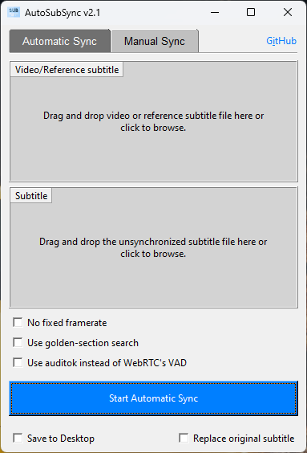
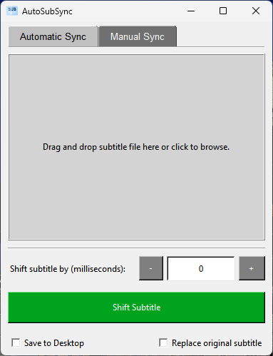

# AutoSubSync: Automatic / Manual Subtitle Synchronization Tool
AutoSubSync is a Python-based application designed to effortlessly synchronize subtitle files by shifting them by a specified number of milliseconds or automatically syncing them. Whether you need to adjust subtitles for a movie or a video, this tool offers a simple and intuitive interface to perform the task efficiently.

> # [Download the Latest Release](https://github.com/denizsafak/AutoSubSync/releases/latest)
> You can download the latest version of the same script from this link.

## `How to Run?`
- Extract the zip.
- Run "run.bat" file.
- After installing the requirements, AutoSubSync will start automatically.

## `Useage`
1) Drag and Drop: Drag and drop subtitle and video/reference subtitle files onto the interface.
2) Browse: Alternatively, click on the interface to browse your system and select subtitle or video files.
3) Easy Open: Before opening the program, you can also drag and drop the subtitle file on run.bat. The program starts with that file selected. 
4) Set Milliseconds: In manual tab, enter the number of milliseconds by which you want to shift the subtitles.
5) Choose Options: Select whether you want to save the shifted subtitle to the desktop or replace the original file.
4) Click Sync: Click on the "Shift Subtitle" button to synchronize the subtitle file.

## `Features`
- Automatic Subtitle Synchronization: Automatically sync the subtitles with the video/reference subtitle, using [ffsubsync](https://github.com/smacke/ffsubsync).
- Subtitle Shifting: Easily adjust subtitle timing by specifying the number of milliseconds to shift.
- Drag and Drop: Simply drag and drop subtitle and video files onto the interface to begin the synchronization process.
- Customization Options: Choose whether to save the shifted subtitle file to the desktop or replace the original file.
- Informative Messages: Receive clear feedback messages indicating the success or failure of the synchronization process.

## `Credits`
- Thanks to creators of [ffsubsync](https://github.com/smacke/ffsubsync), [ffmpeg](https://www.ffmpeg.org/) and others. The automatic subtitle syncing feature is possible because of ffsubsync. This is just a GUI application for Windows that makes the process a bit easier. At the beginning, it was just a manual subtitle syncing program. Now it can do both manual and automatic subtitle sync.
- Icon: [Subtitles icons created by Freepik - Flaticon](https://www.flaticon.com/free-icons/subtitles)

> [!IMPORTANT]
> - The automatic sync feature is not perfect. I recommend you to check the subtitle after syncing.

> [!NOTE]
> - This script is primarily intended for Windows. Adaptations might be needed for other operating systems.

> Tags: automatic subtitle synchronization, autosubsync, automatic sub sync, subtitle synchronization, subtitle shifter, subtitle adjuster, subtitle tools, subtitle utilities, synchronize subtitles, adjust subtitle timing, subtitle management, Python subtitle tool, subtitle manipulation, subtitle synchronization script.
