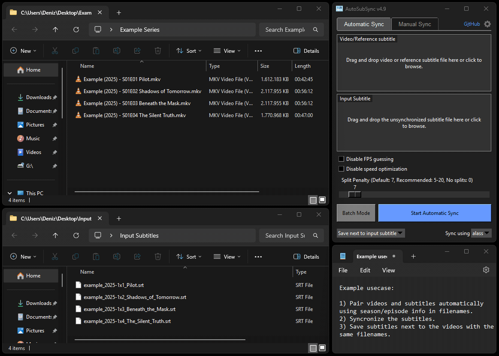

# AutoSubSync: Automatic / Manual Subtitle Synchronization Tool

[](https://github.com/denizsafak/AutoSubSync/actions)
<a href="https://github.com/psf/black"></a>
[](https://github.com/denizsafak/AutoSubSync/releases/latest)
[](https://github.com/denizsafak/AutoSubSync/releases/latest)
[](https://github.com/denizsafak/AutoSubSync/releases/latest)

AutoSubSync is a Python-based application designed to effortlessly synchronize subtitle files by shifting them by a specified number of milliseconds or automatically syncing them. Whether you need to adjust subtitles for a movie or a video, this subtitle sync fixing tool offers a simple and intuitive interface to perform the task efficiently.

   

> # [Download the Latest Release](https://github.com/denizsafak/AutoSubSync/releases/latest)
> You can download the latest executable version of AutoSubSync from this link. <br>
> Or you can also download AutoSubSync from AUR in Arch Linux using the following command:
> ``` 
>yay -S autosubsync-bin 
>```
> Thanks to [@Rainoutt](https://github.com/Rainoutt) for the AUR package.

## `How to Run?`
- Extract the zip.
- Run "AutoSubSync" file.

> MacOS users please read [this](#for-macososx-users).

## `Example Use Case`


## `Useage`
### Automatic Synchronization
1. **Select Video/Reference Subtitle and Subtitle Files:**
   - Drag and drop the video and subtitle files into the respective input boxes.
   - Alternatively, click on the input boxes to browse and select the files.
2. **Choose Synchronization Tool:**
   - Select the synchronization tool (`ffsubsync` or `alass`) from the dropdown menu.
3. **Set Options:**
   - Configure additional options such as `Don't fix framerate`, `Use golden-section search`, and `Voice activity detector (VAD)` for `ffsubsync`.
   - For `alass`, configure options like `Disable FPS guessing`, `Disable speed optimization`, and set the `Split Penalty`.
4. **Select Output Location:**
   - Choose where to save the synchronized subtitle file using the dropdown menu.
5. **Start Synchronization:**
   - Click the `Start Automatic Sync` button to begin the synchronization process.
6. **Batch Mode:**
   - Enable batch mode to process multiple files at once. Drag and drop multiple files or folders into the batch input area.
   - Add `reference subtitle - subtitle` pairs in batch mode. You can add subtitles as `no video` or reference subtitles as `no subtitle`.
   - Use `Auto-Pairing with Season/Episode` to automatically pair multiple subtitles with similar names (e.g., S01E01 pairs with 01x01).
   - Double-click any item to change it.
   - Use the `del` key to delete any item.

     
### Manual Synchronization
1. **Select Subtitle File:**
   - Drag and drop the subtitle file into the input box.
   - Alternatively, click on the input box to browse and select the file.
2. **Set Time Shift:**
   - Enter the number of milliseconds to shift the subtitle. Use the `+` and `-` buttons to adjust the value.
3. **Choose Output Option:**
   - Select whether to save the shifted subtitle to the desktop or replace the original subtitle file.
4. **Start Shifting:**
   - Click the `Shift Subtitle` button to apply the time shift.

 
### Settings (Top Right Corner)
- **Language:** `English`, `Español`, `Deutsch`, `Français`, `Italiano`, `Polski`, `Português`, `Türkçe`, `Tiếng Việt`, `Bahasa Indonesia`, `Bahasa Melayu`, `ไทย`, `Українська`, `Русский`, `中国人`, `日本語`, `한국어`, `हिन्दी`, `বাংলা`, `العربية`, `فارسی`, `اردو` 
(Thanks to [@bayramhayri](https://github.com/bayramhayri) for helping with translations.)
- **Theme:** `System`, `Dark`, `Light`
- **Change log window font:** Configure the font used in the log window. (Trigger log window to preview the changes)
- **Log records and options:** `Keep log records`, `Open logs folder`, and `Clear all logs`
- **Additional arguments for ffsubsync:** Configure additional arguments for ffsubsync.
- **Additional arguments for alass:** Configure additional arguments for alass.
- **Check video for subtitle stream in alass:** Toggle for checking the subtitle streams in video for alass.
- **Backup subtitles before overwriting:** Toggle for creating a backup of subtitles before overwriting them.
- **Keep converted subtitles:** Toggle for keeping the converted subtitles after synchronization.
- **Keep Extracted Subtitles:** Toggle for keeping the extracted subtitles after synchronization.
- **Remember the Changes:** Toggle for remembering changes made.
- **Reset to Default Settings:** Restore settings to default values.


## Features
- **Auto-Pairing with Season/Episode:** Automatically pair videos and reference subtitles with subtitles using Season/Episode patterns like S01E01, 1x01, etc.
- **Synchronization Tools:** Choose between `alass` and `ffsubsync` for automatic subtitle syncing.
- **Batch Processing:** Process multiple video/reference subtitle and subtitle pairs.
- **Subtitle Formats:** Support for different subtitle formats: .srt, .vtt, .sbv, .sub, .ass, .ssa, .dfxp, .ttml, .itt, .stl.
- **Automatic Subtitle Synchronization:** Automatically sync the subtitles with the video/reference subtitle using [ffsubsync](https://github.com/smacke/ffsubsync) or [alass](https://github.com/kaegi/alass).
- **Subtitle Shifting:** Easily adjust subtitle timing by specifying the number of milliseconds to shift.
- **Drag and Drop:** Simply drag and drop subtitle and video files onto the interface to begin the synchronization process.
- **Customization Options:** Choose whether to save the shifted subtitle file to the desktop or replace the original file.
- **Informative Messages:** Receive clear feedback messages indicating the success or failure of the synchronization process.

## `For developers and contributors`
If you'd like to modify the code and contribute to development, you can download the [source code](https://github.com/denizsafak/AutoSubSync/archive/refs/heads/main.zip) and build it using build.py. Ensure Python is installed on your computer before proceeding. Also check [here](https://github.com/denizsafak/AutoSubSync/blob/main/main/resources/README.md).

## `For MacOS/OSX users:`
- You need to give permissions in "System Settings > Security & Privacy" to run the app.<br />
- If does not work, download the [source code](https://github.com/denizsafak/AutoSubSync/archive/refs/heads/main.zip) and build it on your computer using build.py.
- You can use `brew install alass` command to make alass work.
- I haven't tested the `macos-arm64` build. Please open an issue if you face any problems.<br />

## `Credits`
Thanks to creators of [ffsubsync](https://github.com/smacke/ffsubsync), [alass](https://github.com/kaegi/alass), [ffmpeg](https://www.ffmpeg.org/) and others. The automatic subtitle syncing feature is possible because of ffsubsync and alass. This is just a GUI application that makes the process a bit easier. At the beginning, it was just a manual subtitle syncing program. Now it can do both manual and automatic subtitle sync.

Icon: [Subtitles icons created by Freepik - Flaticon](https://www.flaticon.com/free-icons/subtitles)

> [!IMPORTANT]
> The automatic sync feature is not always perfect. I recommend you to check the subtitle after syncing.

> Tags: automatic subtitle synchronization, autosubsync, automatic sub sync, subtitle synchronization, resync subtitles, re-sync subtitles, subtitle shifter, subtitle adjuster, subtitle tools, subtitle utilities, synchronize subtitles, adjust subtitle timing, subtitle management, Python subtitle tool, subtitle manipulation, subtitle synchronization script, subtitle sync fixing, subtitle sync fix, fix subtitle sync.
